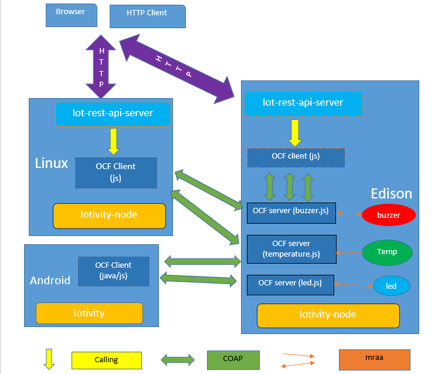

# WhatTheHellIsSmartHomeDemo
SmartHome-Demo materials for Weekly QA learning and sharing

## Topics
* [REST API](http://www.ruanyifeng.com/blog/2011/09/restful.html)
* [OCF Concepts](https://openconnectivity.org/specs/OIC_Core_Specification_v1.1.1.pdf)
* [iotivity](https://www.iotivity.org/)
* [otcshare/iotivity-node](https://github.com/otcshare/iotivity-node)
* [01org/iot-rest-api-server](https://github.com/01org/iot-rest-api-server)
* [01org/SmartHome-Demo](https://github.com/01org/SmartHome-Demo)

### REST API
Ruan Yifeng blog: [理解RESTful架构](http://www.ruanyifeng.com/blog/2011/09/restful.html)
> 我们总结一下什么是RESTful架构：
>
>　　（1）每一个URI代表一种资源；
>
>　　（2）客户端和服务器之间，传递这种资源的某种表现层；
>
>　　（3）客户端通过四个HTTP动词，对服务器端资源进行操作，实现"表现层状态转化"。

### OCF Concepts
From OIC specification 1.1:
* Client:
  > 3.1.1
  >
  > Client
  >
  > a logical entity that accesses a Resource on a Server

* Device:
  > 3.1.6
  > 
  > Device
  >
  > a logical entity that assumes one or more Roles (e.g., Client, Server)

* Resource
  > 3.1.19
  >
  > Resource
  >
  > represents an Entity modelled and exposed by the Framework

* Service
  > 3.1.28
  >
  > Server
  >
  > a Device with the role of providing resource state information and facilitating remote interaction with its resources

OCF clients <-COAP-> OCF servers.

### Iotivity
* IoTivity is an open source software framework enabling seamless device-to-device connectivity to address the emerging needs of the Internet of Things.
* Written in C/C++
* Implements the COAP
* Provides C/C++/Java API.

### otcshare/iotivity-node
Node.js binding for iotivity.
* Client APIs: https://github.com/01org/iot-js-api/blob/master/ocf/client.md
* Server APIs: https://github.com/01org/iot-js-api/blob/master/ocf/server.md

### iot-rest-api-server function
* GET: Read OCF resource properties : sensor states

  Example:

  curl http://<where iot-rest-api-server is launched>:8000/api/oic/d
  
  https://github.com/01org/iot-rest-api-server/blob/master/doc/oic.wk.d.raml

  Retrieve the information about the OIC device

  curl http://<where iot-rest-api-server is launched>:8000/api/oic/res

  https://github.com/01org/iot-rest-api-server/blob/master/doc/oic.wk.res.raml

  Retrieve the discoverable resource set

* POST: Update OCF resource properties : sensor states (The sensor must be controllable)

  Examples:

  curl -X POST -T <JSON format file> http://<where iot-rest-api-server is launched>:8000/api/oic/a/led?di=<uuid> 

  Power on/off LED.

### 01org/SmartHome-Demo
* ocf-servers/js-servers/*.js: When a js file is launched, an OCF server is created and presented in the network.
* Cloud app: present and control the sensors via Web portal. 

## Flow chart

